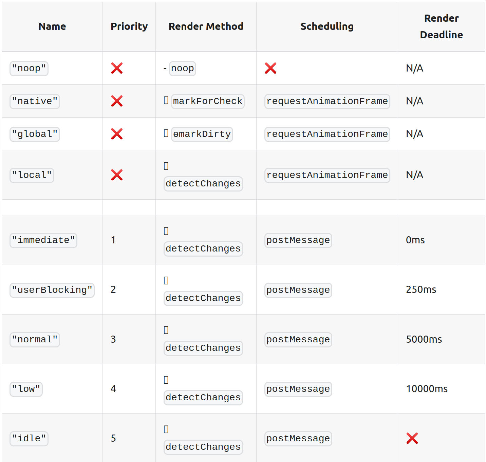

<div style="position: absolute; top: 20px; left: 20px; display: flex; flex-flow: column; align-items: flex-end">  
    
</div>
 <h3>NgXs and RxAngular performance tips and benefits</h3> 

<div style="position: absolute; bottom: 20px; right: 20px; display: flex; flex-flow: column; align-items: flex-end">  
    
</div>


---
transition: fade-out
---

<h2>  Preferred default ngxs settings </h2>

<hr>

```ts
{
    suppressErrors: false,
    injectContainerState: false
}
```

`suppressErrors` - any error in selector will be propagated (if **false**) instead of returning **undefined**
<br>
`injectContainerState` - true will cause all selectors defined within a state class to receive the container class' state model as their first parameter. As a result every selector would be re-evaluated after any change to that state.


---
transition: fade-out
---

<h2>  Selector optimization ! </h2>
<span style="font-size: 10px; color: rgb(177 171 171)">this is the most performance crucial</span>

<hr>

<p style="font-size: 12px">Ensure selectors are properly memoized. By default, they always are, but depending on their param they might be recalculated by any of a 'state' changes</p>

```ts {3-9|11-13|11-19}
@Injectable()
export class ZooState {
    static pandasWithoutMemoize(zooName: string) {
        return createSelector([ZooState], (state: ZooStateModel) => {
            return state[zooName].animals.filter(
                animal => animal.type === 'panda' && animal.age === 'young'
            );
        });
    }
    
    static getZooAnimals(zooName: string) {
        return createSelector([ZooState], (state: ZooStateModel) => state[zooName].animals);
    }

    static pandas(zooName: string) {
        return createSelector([ZooState.getZooAnimals(zooName)], (state: Animal[]) => {
            return state.filter(animal => animal.type === 'panda' && animal.age === 'young');
        });
    }
}
```

---
transition: fade-out
---

More examples:

```ts 
@Selector([SomeState])
static getData(state: SomeStateModel) {
    return state.data;
}

@Selector([SomeState.getData])
static getViewData(data: Data[]) {
    return data.map(d => expensiveFunction(d));
}
```


---
layout: two-cols
transition: fade-out
---

Some potential algorithmic issues:

```html
<ng-container *ngIf="isDataSelected$ | async as isDataSelected">
    <data-check-box *ngFor="data of data$ | async"
        [checked]="isDataSelected(d.id)">
    </data-check-box>
</ng-container>
```

```ts {0-4|0-5|7-11|7-12}
    @Selector([SelectedDataState])
    isDataSelected(state: SelectedDataStateModel) {
        return (id: number) => state.selectedIds.includes(id);
    }
    O(n)
    
    @Selector([SelectedDataState])
    isDataSelected(state: SelectedDataStateModel) {
        const selectedIds = new Set(state.selectedIds);
        return (id: number) => selectedIds.has(id);
    }
    O(1)
```

::right::


---
transition: fade-out
---

Different ways to create selectors:


1. `createPropertySelectors`

```ts
    static slices = createPropertySelectors<AnimalStateModel>(AnimalSate);
```
<br/>
<div v-click>
<Arrow  x1="150" y1="160" x2="150" y2="200" />

```ts
    zebras$ = this.store.select(AnimalsSelectors.slices.zebras);
    // or
    @Selector([AnimalsSelectors.slices.zebras, AnimalsSelectors.slices.pandas])
```
</div>

<div v-click>
2. `createModelSelector`

```ts
  static slices = createPropertySelectors<AnimalStateModel>(AnimalSate);

  static pandasAndZoos = createModelSelector({
    pandas: AnimalsSelectors.slices.pandas,
    zoos: ZoosSelectors.slices.zoos
  });
```

</div>


---
transition: fade-out
---

Different ways to create selectors:


3. `createPickSelector`

```ts
  static fullAnimalsState = createSelector([AnimalState], (state: AnimalStateModel) => state);

  static zebrasAndPandas = createPickSelector(fullAnimalsState, [
    'zebras',
    'pandas'
  ]);

```

<span style="color: #45be39">Best option:</span>
> One of the most useful things about the createPickSelector selector (versus rolling your own that creates a trimmed object from the provided selector), is that it will only emit a new value when a picked property changes, and will not emit a new value if any of the other properties change.

---
transition: fade-out
---
<h2>Other improvements/considerations</h2>

<hr>
<ul>
<li>
Use
    <a href="https://www.ngxs.io/advanced/token">StateToken</a>
for better typing
   - improves typescript automatic inferring of the type.
</li>
<li v-click>
Stick to one approach of modifying state inside action handlers
 
Prefer: 

```ts
    ctx.setState(
        patch<AnimalsStateModel>({
          monkeys: []
        })
    );
```

Instead of:

```ts
const state = ctx.getState();
    ctx.setState({
       ...state,
        monkeys: []
    });
```

</li>
</ul>


---
transition: fade-out
---

<ul>
<li>
 Look at the store not only as a server requests handler but as a data managing. Use dispatch to modify data (payloads; form-data etc...) following single source of truth principle.
</li>
<li v-click>
It is not recommended to store class instances instead of literal objects in a store. (We are using class-transfomer so I don't see how we can follow this recommendation. It might be a problem in case we decide to use some sort of caching. It often requires some serialization/deserialization which is problematic with class instances)
</li>
<li v-click>
 Namespace actions so it's easier to see where are they coming from.
</li>
<li v-click>
Use  { cancelUncompleted: true } so prev actions is canceled

```ts
 @Action(FeedAnimals, { cancelUncompleted: true })
```
</li>
</ul>

---
transition: fade-out
---
<h2>Some RxAngular 🤔 / template</h2>
<hr>

Why ?


> With the help of RxAngular directive even small unit within component becomes the directive's EmbeddedView. This enables fine-grained reactivity on template binding level which comes with a dramatic performance boost. (EmbeddedView.detectChanges)

---
transition: fade-out
---
All possible strategies



---
transition: fade-out
---

RxLet

```html

 <div
      *rxLet="bgColor$;
       let bgColor;
        error: error;
        complete: complete;
        suspense: suspense;
        patchZone: false;
        parent: false"
      (mousemove)="calcBgColor($event)"
    >
     
 </div>

 <ng-template #suspense>LOADING</ng-template>
 <ng-template #error>ERROR</ng-template>
 <ng-template #complete>COMPLETE</ng-template>
```

---
transition: fade-out
---

RxFor

```html
  <li
    *rxFor="
      let item of observableItems$; trackBy: 'id';
      let count = count;
      let index = index;
      let first = first;
      let last = last;
      let even = even;
      let odd = odd;
    ">
</li>
```
---
transition: fade-out
---
Unpatch
<p style="font-size: 10px; color: rgb(177 171 171)">helps developers to partially deactivate NgZone</p>


```html
    <button [unpatch] (click)="triggerSomeMethod($event)">click me</button>
```

---
transition: fade-out
---

Push
<p style="font-size: 10px; color: rgb(177 171 171)">it's like 'async' pipe but handles change detection with different strategies</p>

```html
<hero-search [term]="searchTerm$ | push"> </hero-search>
```